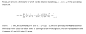

# π pi-day-2025-with-py
Celebrate the work done by Saha / Sinha who found another infinite series to calculate pi that converges much quicker than the Madhava series.

**[Design and tasks](./TODO.md)**

* Python during build steps
* Zig for wasm
* SolidJS for ui
* 1,000,000 digits of pi
  * visualize digits using color pallete like [pi-day-2024-with-py](https://github.com/klmcwhirter/pi-day-2024-with-py)
  * UI element to modify value for λ (lambda) parameter = default is between 10 and 100 per the Appendix
  * visualize accuracy against baseline
  * show histrograms - Saha / Sinha series with several interesting values for λ, Gosper's Series, baseline

### Snippet from paper Appendix

## References
* [Appendix - Field Theory Expansions of String Theory Amplitudes - journals.aps.org](https://journals.aps.org/prl/abstract/10.1103/PhysRevLett.132.221601#und4)
* [Scientists Just Discovered A New Formula For Pi Accidentally - MindYourDecisions](https://youtu.be/t1ZnptSEPI8) - 10 min
* [Pi-oneers (interview with Sinha & Saha) - Numberphile](https://youtu.be/2lvTjEZ-bbw) - 25 mins
* [Digits of Pi - Up to 1 Million Digits](https://www.angio.net/pi/digits.html)

## Tech References
* [Compiling Python to Native Wasm](https://youtu.be/_Gq273qvNMg) using [wasmer.io py2wasm](https://wasmer.io/posts/py2wasm-a-python-to-wasm-compiler) - still produces large wasm files & requires Python 3.11 (not 3.12+) - **wait for 3.12 support**
* [MDN Web - Canvas API Tutorial](https://developer.mozilla.org/en-US/docs/Web/API/Canvas_API/Tutorial)
